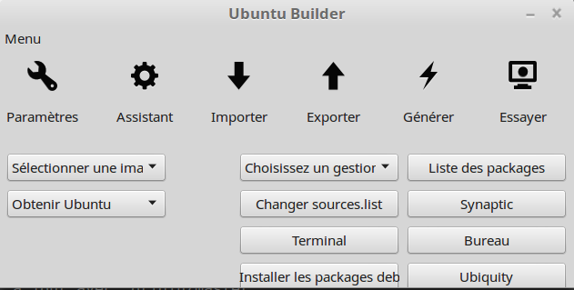

# Ubuntu-Builder

Un outil pratique pour construire une distribution GNU / Linux basée sur Ubuntu

Ubuntu Builder est un outil simple pour créer votre propre distribution. Il permet de télécharger, extraire, personnaliser de nombreuses façons et reconstruire les images ubuntu. Vous pouvez personnaliser les images ISO de bureau i386 et amd64.


## Obtenez Ubuntu Builder et une source ISO

[Ubuntu Builder](https://launchpad.net/ubuntu-builder) automatise de nombreuses étapes préliminaires qui doivent être effectuées à la main (monter ISO, extraire des squashfs, créer un chroot, etc.)Il vous donne aussi Synaptic et un chroot "graphique".

**Ajoutez le PPA pour installer Ubuntu Builder:**

```
sudo add-apt-repository ppa:kamilion/ubuntu-builder
sudo apt-get update
sudo apt-get install ubuntu-builder
```

**Téléchargez également l'image ISO d'Ubuntu avec laquelle vous souhaitez travailler.**

## Les bases d'Ubuntu Builder
Démarrez Ubuntu Builder à partir du lanceur. Je vous recommande de mettre tous les trois champs à "Ubuntu" (comme le LiveCD réel), parce que la mise en place de champs personnalisés conduit à un crash du Software Center. Lorsque vous installez, vous pouvez toujours choisir votre propre nom d'utilisateur, nom de machine, etc.



Chargez votre ISO avec l'option **Depuis le disque local**, bien que Ubuntu Builder devrait pouvoir télécharger l'ISO si vous le voulez.

Les boutons sur la droite sont explicites. La **Terminal** vous donne un chroot CLI, tandis que **Bureau** vous en donne un graphique!, c'est-à-dire une session LiveCD. (Celui-ci peut prendre un certain temps à charger). Notez que **Choisissez un gestionnaire de fenêtre** fait parfois un travail incomplet, il est donc préférable de l'installer via apt-get ou Synaptic.
